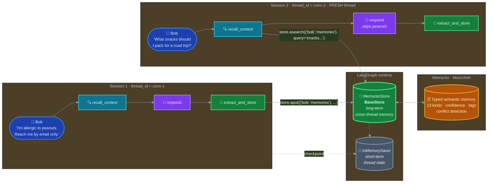

# LangGraph + Memanto: Give Your Graph a Permanent Brain

A runnable customer-support agent that uses **[Memanto](https://memanto.ai)** as its long-term, cross-thread memory layer for **[LangGraph](https://github.com/langchain-ai/langgraph)**. Memories survive a brand-new `thread_id`, a fresh checkpointer, and a different Python process.

> **Key design:** `MemantoStore` is a real `langgraph.store.base.BaseStore` subclass — the official LangGraph long-term memory abstraction, drop-in alongside `InMemoryStore`, `PostgresStore`, and `RedisStore`.

## Demo

<!-- Drop the recorded GIF/MP4 here. Recommended: 30-second screen capture of
     `python run_full_demo.py` showing Session 1 storing the peanut allergy
     and Session 2 (new thread_id) recalling it without prior thread state. -->

> _Demo GIF: see `assets/langgraph-memanto-demo.gif` (recorded from `python run_full_demo.py`)._

## Architecture



**Two persistence layers, one graph:**

| Layer | LangGraph abstraction | What it persists | Scope |
|---|---|---|---|
| 🧠 Checkpointer (`InMemorySaver`) | `BaseCheckpointSaver` | Graph state snapshots | One `thread_id` |
| 💎 Store (`MemantoStore`) | `BaseStore` | User-scoped memories | Cross-thread, cross-session |

Per the [official LangGraph docs](https://docs.langchain.com/oss/python/langgraph/add-memory):

> _"Short-term, raw context is saved through checkpoint objects, while intelligent long term memory retrieval is done by saving and searching through memory stores."_

They're not interchangeable. We use both, each for its proper job.

## What this demonstrates

* **Cross-session recall.** Run session 1, kill the process, start session 2 with a *different* `thread_id` — the agent still remembers everything important about the user. The checkpointer is gone; the store remains.
* **Official `BaseStore` integration point.** `MemantoStore` is a real `BaseStore` subclass. Nodes declare `*, store: BaseStore` and LangGraph injects the compiled store automatically — no Memanto-specific glue inside node code.
* **Typed semantic memory.** The extractor LLM picks from 13 Memanto memory categories (fact, preference, goal, decision, observation, …) so retrieval can filter by kind.
* **Rate-limit resilience.** LangGraph's `RetryPolicy` is wired to LLM nodes (`max_attempts=5`, `initial_interval=32 s`) so transient OpenRouter 429s are transparently retried without crashing the graph.
* **Conflict-aware long-term memory (bonus).** When a new memory contradicts an old one, Memanto's daily-summary pass flags it; the bonus script shows programmatic resolution.

## Prerequisites

* Python 3.10+
* A [Moorcheh API key](https://console.moorcheh.ai/api-keys) (free tier: 100K ops/month)
* An [OpenRouter API key](https://openrouter.ai/keys) (free tier available — same provider used by the CrewAI example)

## Setup

```bash
python -m venv venv
source venv/bin/activate            # Windows: venv\Scripts\activate
pip install -r requirements.txt
cp .env.example .env
# Edit .env and add MOORCHEH_API_KEY and OPENROUTER_API_KEY
```

## Step-by-step demo (proves persistence)

This is the recommended flow for recording the 30-second demo:

```bash
# Session 1: Bob shares preferences. The graph stores them via MemantoStore.
python run_session_1.py

# Session 2: NEW thread_id, NEW process. Bob asks a road-trip snack question.
# The agent recalls his peanut allergy via store.asearch and answers safely.
python run_session_2.py

# Bonus: stores contradictory preferences across sessions, surfaces Memanto's
# conflict report, resolves programmatically.
python run_contradiction.py
```

Or run both sessions in one process for the cleanest GIF:

```bash
python run_full_demo.py
```

## File structure

```text
examples/langgraph-memanto/
├── README.md                # this file
├── requirements.txt         # Python deps
├── .env.example             # API key template
├── state.py                 # SupportState TypedDict (messages only)
├── memanto_setup.py         # Agent lifecycle helper (create + activate + teardown)
├── memanto_store.py         # MemantoStore(BaseStore) - the LangGraph integration
├── graph.py                 # build_support_graph: recall → respond → extract_and_store
├── run_session_1.py         # Session 1: store preferences
├── run_session_2.py         # Session 2 (new thread): prove recall
├── run_full_demo.py         # Both sessions back-to-back for the demo GIF
└── run_contradiction.py     # Bonus: conflict detection + resolution
```

## How `MemantoStore` slots in

If you already have a LangGraph agent using `InMemoryStore`, swapping in `MemantoStore` is a one-line change:

```python
# Before: in-memory, lost when the process dies
from langgraph.store.memory import InMemoryStore
store = InMemoryStore()

# After: persistent, cross-session, typed semantic memory
from memanto_setup import MemantoSetup
from memanto_store import MemantoStore

client = MemantoSetup(api_key).setup(agent_id="my-app")
store = MemantoStore(client, agent_id="my-app")

# Compile exactly the same way — nothing else changes:
graph = builder.compile(checkpointer=checkpointer, store=store)
```

Your nodes use LangGraph's official store injection pattern — declare `*, store: BaseStore` and the compiled store is injected automatically:

```python
from langgraph.store.base import BaseStore

async def my_node(state: MyState, config, *, store: BaseStore) -> dict:
    memories = await store.asearch(("user-id", "memories"), query="...")
    await store.aput(("user-id", "memories"), "key", {"content": "..."})
    return {}
```

No Memanto-specific imports inside your nodes. That's the whole point of being a `BaseStore` subclass.

## The `MemantoStore` ↔ Memanto mapping

| BaseStore | Memanto |
|---|---|
| `namespace=(p0, p1, ...)` | Reserved tags `lg:ns:0:p0`, `lg:ns:1:p1`, ... |
| `key="..."` | Reserved tag `lg:key:<key>` |
| `value["kind"]` or `value["type"]` | `memory_type` (default `"fact"`) |
| `value["title"]` | `title` (auto-derived if absent) |
| `value["content"]` | `content` (auto-stringified if absent) |
| `value["confidence"]` | `confidence` (default `0.8`) |
| `value["tags"]` | User tags (joined with reserved) |
| `SearchOp.query` | recall query (`"*"` if empty) |
| `SearchOp.filter["type"]` | Type filter |
| `SearchOp.filter["min_confidence"]` | Min confidence threshold |

### Honest limitations

* **Delete via `PutOp(value=None)` raises `NotImplementedError`.** Memanto removes memories through its conflict-resolution flow, not free-form deletion. Use `memanto conflicts resolve` or the SdkClient resolve API.
* **`ttl` on put is ignored.** Memanto memories don't expire on a timer.
* **Pagination `offset` in search is ignored.** Memanto recall doesn't paginate; raise the `limit` instead.
* **`list_namespaces` is best-effort.** It samples recent memories and derives unique namespaces from their tags.

These are documented up-front rather than papered over.

## Comparison table

| Capability | LangGraph `InMemoryStore` | `MemantoStore` |
|---|---|---|
| Persistence | Process lifetime only | Permanent (cloud) |
| Cross-thread | Yes (in-process) | Yes (any process, any time) |
| Semantic search | Optional, needs embedding config | Built-in (Moorcheh) |
| Typed memory categories | Untyped values | 13 typed kinds (fact, preference, decision, …) |
| Confidence scoring | No | Yes (`0.0`–`1.0`) |
| Conflict detection | No | Yes (daily summary pass) |
| RAG answer endpoint | No | Yes (`client.answer`) |
| Cost at idle | 0 | 0 (serverless free tier) |

## Troubleshooting

* **`MOORCHEH_API_KEY not set`** — copy `.env.example` to `.env` and fill it in.
* **`OPENROUTER_API_KEY not set`** — the graph routes `langchain-openai` through OpenRouter. Set the env var or override the model via `LANGGRAPH_LLM` (e.g. `LANGGRAPH_LLM=openai/gpt-4o-mini`).
* **`429 RateLimitError` from OpenRouter** — the default free model (`openai/gpt-oss-120b:free`) is subject to upstream rate limits. The graph's `RetryPolicy` handles this automatically (retries up to 5× with 32 s back-off). If retries are exhausted, set `LANGGRAPH_LLM` to a paid model or add billing credits to your OpenRouter account.
* **`Agent 'langgraph-customer-support' already exists`** — fine. `MemantoSetup.setup` is idempotent; it reuses existing agents.
* **No conflicts detected in `run_contradiction.py`** — Memanto's conflict detection runs during the daily-summary pass and depends on semantic similarity. The script prints a note explaining this when no conflicts surface.

## See also

* [Memanto documentation](https://docs.memanto.ai)
* [`examples/crewai-memory/`](../crewai-memory/) — the CrewAI sibling demo, same 13-type memory story.
* [LangGraph: Add Memory](https://docs.langchain.com/oss/python/langgraph/add-memory)
* [LangGraph: Store API reference](https://reference.langchain.com/python/langgraph/store)
